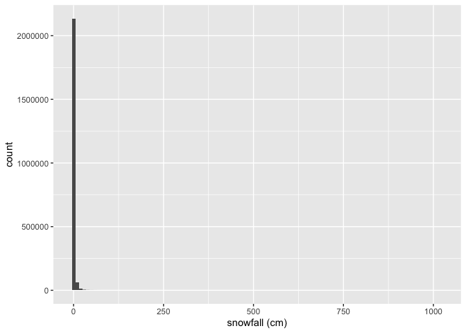
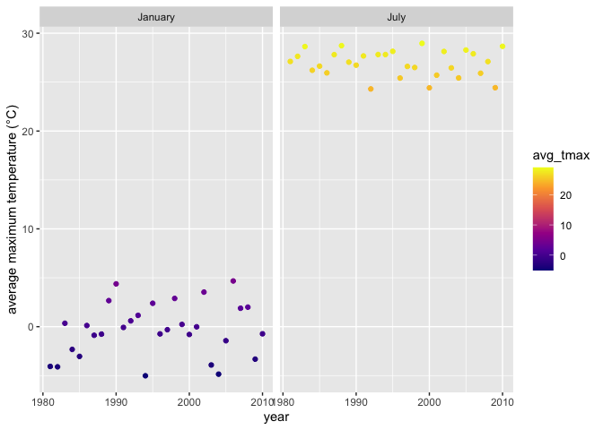
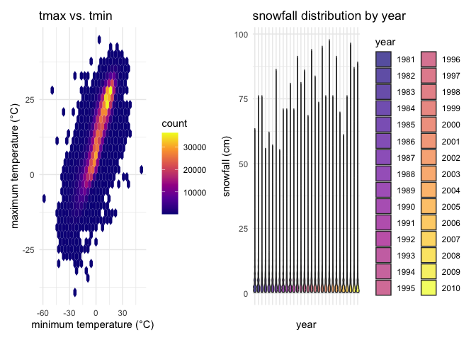

Homework 3
================
Mia Isaacs
2024-10-11

# load libraries

``` r
library(tidyverse)
```

    ## ── Attaching core tidyverse packages ──────────────────────── tidyverse 2.0.0 ──
    ## ✔ dplyr     1.1.4     ✔ readr     2.1.5
    ## ✔ forcats   1.0.0     ✔ stringr   1.5.1
    ## ✔ ggplot2   3.5.1     ✔ tibble    3.2.1
    ## ✔ lubridate 1.9.3     ✔ tidyr     1.3.1
    ## ✔ purrr     1.0.2     
    ## ── Conflicts ────────────────────────────────────────── tidyverse_conflicts() ──
    ## ✖ dplyr::filter() masks stats::filter()
    ## ✖ dplyr::lag()    masks stats::lag()
    ## ℹ Use the conflicted package (<http://conflicted.r-lib.org/>) to force all conflicts to become errors

``` r
library(viridis)
```

    ## Loading required package: viridisLite

``` r
library(patchwork)
```

# question 1

``` r
library(p8105.datasets)
data("ny_noaa")

summary(ny_noaa)
```

    ##       id                 date                 prcp               snow       
    ##  Length:2595176     Min.   :1981-01-01   Min.   :    0.00   Min.   :  -13   
    ##  Class :character   1st Qu.:1988-11-29   1st Qu.:    0.00   1st Qu.:    0   
    ##  Mode  :character   Median :1997-01-21   Median :    0.00   Median :    0   
    ##                     Mean   :1997-01-01   Mean   :   29.82   Mean   :    5   
    ##                     3rd Qu.:2005-09-01   3rd Qu.:   23.00   3rd Qu.:    0   
    ##                     Max.   :2010-12-31   Max.   :22860.00   Max.   :10160   
    ##                                          NA's   :145838     NA's   :381221  
    ##       snwd            tmax               tmin          
    ##  Min.   :   0.0   Length:2595176     Length:2595176    
    ##  1st Qu.:   0.0   Class :character   Class :character  
    ##  Median :   0.0   Mode  :character   Mode  :character  
    ##  Mean   :  37.3                                        
    ##  3rd Qu.:   0.0                                        
    ##  Max.   :9195.0                                        
    ##  NA's   :591786

Do some data cleaning. Create separate variables for year, month, and
day. Ensure observations for temperature, precipitation, and snowfall
are given in reasonable units.

``` r
noaa_df =  
  janitor::clean_names(ny_noaa) |> 
  mutate(
    year = as.numeric(str_sub(date, 1, 4)),
    month = as.numeric(str_sub(date, 6, 7)),
    day = as.numeric(str_sub(date, 9, 10)),
    prcp = as.numeric(prcp) / 100,
    snow = as.numeric(snow) / 10,
    snwd = as.numeric(snwd) / 10,
    tmax = as.numeric(tmax) / 10,
    tmin = as.numeric(tmin) / 10
  ) |> 
  filter(snow >= 0) |> 
  select(-date)

view(noaa_df)
```

The units for precipitation, snowfall, and snow depth were converted to
cm and the unit for max temp and min temp was converted to degrees C.

For snowfall, what are the most commonly observed values? Why?

``` r
noaa_df |> 
  ggplot(aes(x = snow)) + 
  geom_histogram(binwidth = 10) +
  labs(x = "snowfall (cm)")
```

<!-- -->

``` r
mode_snow <- noaa_df |> 
  count(snow, sort = TRUE) |> 
  slice(1) |> 
  pull(snow)

print(mode_snow)
```

    ## [1] 0

The most commonly observed value for snowfall is 0 because most days of
the year it does not snow in New York.

Make a two-panel plot showing the average max temperature in January and
in July in each station across years. Is there any observable /
interpretable structure? Any outliers?

``` r
noaa_df |>
  filter(month == 1 | month == 7) |>
  group_by(year, month) |>
  summarize(avg_tmax = mean(tmax, na.rm = TRUE)) |>
  ggplot(aes(x = year, y = avg_tmax, color = avg_tmax)) +
  geom_point() +
  facet_grid(. ~ factor(month, levels = c(1, 7), labels = c("January", "July"))) +
  scale_color_viridis_c(option = "plasma") +
  labs(y = "average maximum temperature (°C)")
```

    ## `summarise()` has grouped output by 'year'. You can override using the
    ## `.groups` argument.

<!-- -->

It is evident from the two-panel plot that the avg max temp in January
ranges between -5ºC and 5ºC, whereas the avg max temp in July ranges
between 24ºC and 30ºC. There do not appear to be any outliers in either
January or July, although the avg max temps do fluctuate significantly
across the years.

Make a two-panel plot showing (i) tmax vs tmin for the full dataset
(note that a scatterplot may not be the best option); and (ii) make a
plot showing the distribution of snowfall values greater than 0 and less
than 100 separately by year.

``` r
plot_i <- noaa_df |>
  ggplot(aes(x = tmin, y = tmax)) +
  geom_hex() +
  scale_fill_viridis_c(option = "plasma") +
  labs(title = "tmax vs. tmin", x = "minimum temperature (°C)", y = "maximum temperature (°C)", fill = "count") +
  theme_minimal()
```

``` r
plot_ii <- noaa_df |>
  filter(snow > 0 & snow < 100) |>
  ggplot(aes(x = factor(year), y = snow, fill = factor(year))) +  
  geom_violin(alpha = 0.7) +  
  labs(title = "snowfall distribution by year", 
       x = "year", 
       y = "snowfall (cm)", 
       fill = "year") +
  scale_fill_viridis_d(option = "plasma") +
  theme_minimal() +
  theme(axis.text.x = element_blank())
```

``` r
combined_plot <- plot_i + plot_ii
print(combined_plot)
```

    ## Warning: Removed 927387 rows containing non-finite outside the scale range
    ## (`stat_binhex()`).

<!-- -->
