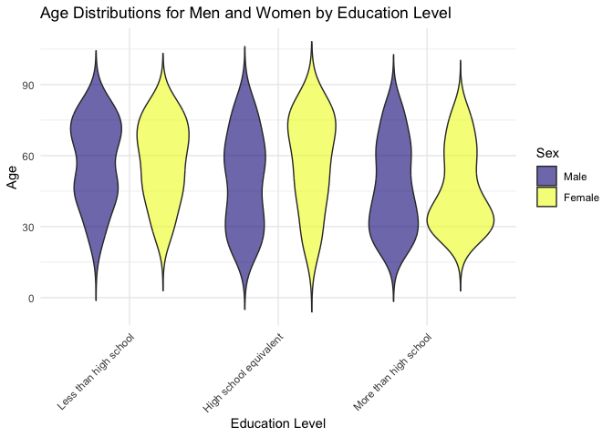
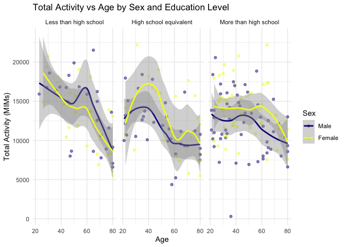
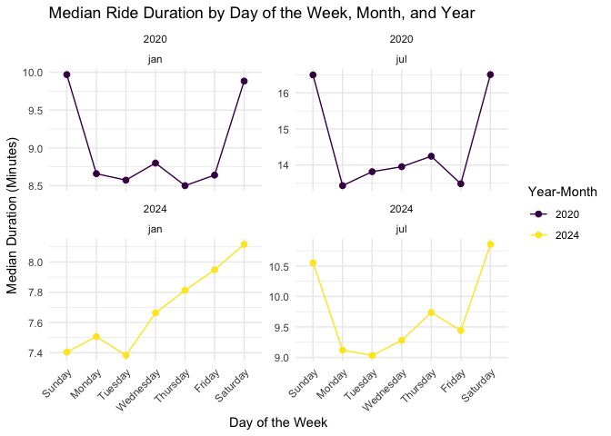
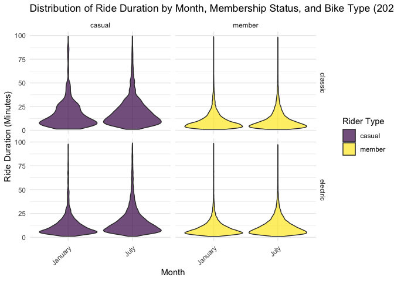

Homework 3
================
Mia Isaacs
2024-10-11

# load libraries

``` r
library(tidyverse)
```

    ## ── Attaching core tidyverse packages ──────────────────────── tidyverse 2.0.0 ──
    ## ✔ dplyr     1.1.4     ✔ readr     2.1.5
    ## ✔ forcats   1.0.0     ✔ stringr   1.5.1
    ## ✔ ggplot2   3.5.1     ✔ tibble    3.2.1
    ## ✔ lubridate 1.9.3     ✔ tidyr     1.3.1
    ## ✔ purrr     1.0.2     
    ## ── Conflicts ────────────────────────────────────────── tidyverse_conflicts() ──
    ## ✖ dplyr::filter() masks stats::filter()
    ## ✖ dplyr::lag()    masks stats::lag()
    ## ℹ Use the conflicted package (<http://conflicted.r-lib.org/>) to force all conflicts to become errors

``` r
library(viridis)
```

    ## Loading required package: viridisLite

``` r
library(patchwork)
library(knitr)
```

# question 1

``` r
library(p8105.datasets)
data("ny_noaa")

summary(ny_noaa)
```

    ##       id                 date                 prcp               snow       
    ##  Length:2595176     Min.   :1981-01-01   Min.   :    0.00   Min.   :  -13   
    ##  Class :character   1st Qu.:1988-11-29   1st Qu.:    0.00   1st Qu.:    0   
    ##  Mode  :character   Median :1997-01-21   Median :    0.00   Median :    0   
    ##                     Mean   :1997-01-01   Mean   :   29.82   Mean   :    5   
    ##                     3rd Qu.:2005-09-01   3rd Qu.:   23.00   3rd Qu.:    0   
    ##                     Max.   :2010-12-31   Max.   :22860.00   Max.   :10160   
    ##                                          NA's   :145838     NA's   :381221  
    ##       snwd            tmax               tmin          
    ##  Min.   :   0.0   Length:2595176     Length:2595176    
    ##  1st Qu.:   0.0   Class :character   Class :character  
    ##  Median :   0.0   Mode  :character   Mode  :character  
    ##  Mean   :  37.3                                        
    ##  3rd Qu.:   0.0                                        
    ##  Max.   :9195.0                                        
    ##  NA's   :591786

Do some data cleaning. Create separate variables for year, month, and
day. Ensure observations for temperature, precipitation, and snowfall
are given in reasonable units.

``` r
noaa_df =  
  janitor::clean_names(ny_noaa) |> 
  mutate(
    year = as.numeric(str_sub(date, 1, 4)),
    month = as.numeric(str_sub(date, 6, 7)),
    day = as.numeric(str_sub(date, 9, 10)),
    prcp = as.numeric(prcp) / 100,
    snow = as.numeric(snow) / 10,
    snwd = as.numeric(snwd) / 10,
    tmax = as.numeric(tmax) / 10,
    tmin = as.numeric(tmin) / 10
  ) |> 
  filter(snow >= 0) |> 
  select(-date)

view(noaa_df)
```

The units for precipitation, snowfall, and snow depth were converted to
cm and the unit for max temp and min temp was converted to degrees C.

For snowfall, what are the most commonly observed values? Why?

``` r
noaa_df |> 
  ggplot(aes(x = snow)) + 
  geom_histogram(binwidth = 10) +
  labs(x = "snowfall (cm)")
```

<!-- -->

``` r
mode_snow <- noaa_df |> 
  count(snow, sort = TRUE) |> 
  slice(1) |> 
  pull(snow)

print(mode_snow)
```

    ## [1] 0

The most commonly observed value for snowfall is 0 because most days of
the year it does not snow in New York.

Make a two-panel plot showing the average max temperature in January and
in July in each station across years. Is there any observable /
interpretable structure? Any outliers?

``` r
noaa_df |>
  filter(month == 1 | month == 7) |>
  group_by(year, month) |>
  summarize(avg_tmax = mean(tmax, na.rm = TRUE)) |>
  ggplot(aes(x = year, y = avg_tmax, color = avg_tmax)) +
  geom_point() +
  facet_grid(. ~ factor(month, levels = c(1, 7), labels = c("January", "July"))) +
  scale_color_viridis_c(option = "plasma") +
  labs(y = "average maximum temperature (°C)")
```

    ## `summarise()` has grouped output by 'year'. You can override using the
    ## `.groups` argument.

<!-- -->

It is evident from the two-panel plot that the avg max temp in January
ranges between -5ºC and 5ºC, whereas the avg max temp in July ranges
between 24ºC and 30ºC. There do not appear to be any outliers in either
January or July, although the avg max temps do fluctuate significantly
across the years.

Make a two-panel plot showing (i) tmax vs tmin for the full dataset
(note that a scatterplot may not be the best option); and (ii) make a
plot showing the distribution of snowfall values greater than 0 and less
than 100 separately by year.

``` r
plot_i <- noaa_df |>
  ggplot(aes(x = tmin, y = tmax)) +
  geom_hex() +
  scale_fill_viridis_c(option = "plasma") +
  labs(title = "tmax vs. tmin", x = "minimum temperature (°C)", y = "maximum temperature (°C)", fill = "count") +
  theme_minimal()
```

``` r
plot_ii <- noaa_df |>
  filter(snow > 0 & snow < 100) |>
  ggplot(aes(x = factor(year), y = snow, fill = factor(year))) +  
  geom_violin(alpha = 0.7) +  
  labs(title = "snowfall distribution by year", 
       x = "year", 
       y = "snowfall (cm)", 
       fill = "year") +
  scale_fill_viridis_d(option = "plasma") +
  theme_minimal() +
  theme(axis.text.x = element_blank())
```

``` r
combined_plot <- plot_i + plot_ii
print(combined_plot)
```

    ## Warning: Removed 927387 rows containing non-finite outside the scale range
    ## (`stat_binhex()`).

<!-- -->

# question 2

Load, tidy, merge, and otherwise organize the data sets. Your final
dataset should include all originally observed variables; exclude
participants less than 21 years of age, and those with missing
demographic data; and encode data with reasonable variable classes
(i.e. not numeric, and using factors with the ordering of tables and
plots in mind).

``` r
covar_df =
  read_csv("data/nhanes_covar.csv", skip = 4, na = c("NA", ".", "")) |> 
  janitor::clean_names()
```

    ## Rows: 250 Columns: 5
    ## ── Column specification ────────────────────────────────────────────────────────
    ## Delimiter: ","
    ## dbl (5): SEQN, sex, age, BMI, education
    ## 
    ## ℹ Use `spec()` to retrieve the full column specification for this data.
    ## ℹ Specify the column types or set `show_col_types = FALSE` to quiet this message.

``` r
view(covar_df)
```

This dataset contains 250 rows and 5 columns and the variables seqn,
sex, age, bmi, education.

``` r
accel_df =
  read_csv("data/nhanes_accel.csv", na = c("NA", ".", "")) |> 
  janitor::clean_names()
```

    ## Rows: 250 Columns: 1441
    ## ── Column specification ────────────────────────────────────────────────────────
    ## Delimiter: ","
    ## dbl (1441): SEQN, min1, min2, min3, min4, min5, min6, min7, min8, min9, min1...
    ## 
    ## ℹ Use `spec()` to retrieve the full column specification for this data.
    ## ℹ Specify the column types or set `show_col_types = FALSE` to quiet this message.

``` r
view(accel_df)
```

This dataset contains 250 rows and 1441 columns and the variables min1
to min1440.

``` r
merged_df =
  left_join(covar_df, accel_df, by = "seqn") |> 
  filter(age >= 21) |> 
  drop_na() |> 
  mutate(
    sex = factor(sex, levels = c(1, 2), labels = c("Male", "Female")),
    age = as.numeric(age),
    bmi = as.numeric(bmi),
    education = factor(education, 
      levels = c(1, 2, 3), 
      labels = c("Less than high school", "High school equivalent", "More than high school"),
      ordered = TRUE),
    across(min1:min1440, as.numeric)
  )

view(merged_df)
```

The covar_df and accel_df datasets were merged to create the merged_df
in which there are 228 rows and 1445 columns. Those below age 21 or
missing demographic data were removed from the data frame. Sex and
education were set as factor variables, and age, bmi, and min1-min1440
were set as numeric variables so they will be treated as continuous in
analysis and visualization.

Produce a reader-friendly table for the number of men and women in each
education category, and create a visualization of the age distributions
for men and women in each education category. Comment on these items.

``` r
edu_table <- merged_df |> 
  count(education, sex) |> 
  pivot_wider(names_from = sex, values_from = n, values_fill = 0) |> 
  rename("Education Level"= education)

kable(edu_table, format = "markdown", caption = "Number of Men and Women in Each Education Category")
```

| Education Level        | Male | Female |
|:-----------------------|-----:|-------:|
| Less than high school  |   27 |     28 |
| High school equivalent |   35 |     23 |
| More than high school  |   56 |     59 |

Number of Men and Women in Each Education Category

The table above shows the frequency of males and females within each
education level. Among those with less than a high school education, 27
are males and 28 are females. Among those with a high school equivalent
education, 35 are male and 23 are female. Among those with more than a
high school education, 56 are male and 59 are female.

``` r
ggplot(merged_df, aes(x = education, y = age, fill = sex)) +
  geom_violin(trim = FALSE, alpha = 0.6) +
  scale_fill_viridis_d(option = "plasma") +
  labs(
    title = "Age Distributions for Men and Women by Education Level",
    x = "Education Level",
    y = "Age",
    fill = "Sex"
  ) +
  theme_minimal() +
  theme(
    axis.text.x = element_text(angle = 45, hjust = 1)
  )
```

<!-- -->

The violin plots showing age distribution by sex and education level
reveal that age distributions differ by sex and education level. Most
people with less than a high school education are between the ages of
about 65 and 75 for both males and females. Among those with a high
school equivalent education, the age distribution for males is fairly
even and for females contains more people who are between the ages of
about 65 and 75. Lastly, for those with more than a high school
education, the age distributions show that most people are between the
ages of 25 and 45 for both males and females.

Traditional analyses of accelerometer data focus on the total activity
over the day. Using your tidied dataset, aggregate across minutes to
create a total activity variable for each participant. Plot these total
activities (y-axis) against age (x-axis); your plot should compare men
to women and have separate panels for each education level. Include a
trend line or a smooth to illustrate differences. Comment on your plot.

``` r
total_activity <- merged_df |>  
  mutate(total_activity = rowSums(select(merged_df, starts_with('min')), na.rm = TRUE)) |>
  select(-(min1:min1440))

view(total_activity)
```

Data from min1 to min1440 was combined to create total_activity and the
extra columns were removed for tidiness.

``` r
ggplot(total_activity, aes(x = age, y = total_activity, color = sex)) +
  geom_point(alpha = 0.5) +
  geom_smooth(method = "loess", se = TRUE) +
  facet_wrap(~ education) +
  labs(
    title = "Total Activity vs Age by Sex and Education Level",
    x = "Age",
    y = "Total Activity (MIMs)",
    color = "Sex"
  ) +
  scale_color_viridis_d(option = "plasma") + 
  theme_minimal()
```

    ## `geom_smooth()` using formula = 'y ~ x'

<!-- -->

The above scatterplots show total activity in MIMS across age, education
level, and sex. It is evident that for both females and males across all
education levels, total activity decreases as age increases. For those
with less than a high school education, total activity displays a sudden
increase around age 55 and subsequently decreases around age 60. For
those with a high school equivalent education, total activity increases
around age 25 and decreases around age 40, with females achieving
significantly more MIMS than males. For those with more than a high
school education, total activity is more consistent across age with
females achieving more MIMS than males. The distributions for total
activity have large spreads for each education level and sex, and there
appears to be a significant outlier in the “more than high school” group
whose total activity is close to 0 MIMS.

Accelerometer data allows the inspection activity over the course of the
day. Make a three-panel plot that shows the 24-hour activity time
courses for each education level and use color to indicate sex. Describe
in words any patterns or conclusions you can make based on this graph;
including smooth trends may help identify differences.

``` r
day_activity <- merged_df |> 
    pivot_longer(
    cols = min1:min1440,
    names_to = "minute",
    values_to = "mims",
    names_prefix = "min"
  )

view(day_activity)
```

Used pivot longer to make MIMS data easier to manipulate into 24-hour
time courses.

``` r
day_activity |> 
  mutate(
    minute = as.numeric(minute),
    hour = (minute - 1) / 60
  ) |> 
  group_by(seqn, hour, sex, education) |> 
  summarize(avg_mims = sum(mims), .groups = "drop") |> 
  
  ggplot(aes(x = hour, y = avg_mims, color = sex)) +
  geom_smooth(se = FALSE) +
  facet_grid(. ~ education) +
  labs(
    title = "24-hour Accelerometer Activity",
    x = "Hour",
    y = "Average MIMS",
    color = "Sex",
  ) +
  theme_minimal() +
  scale_color_viridis_d(option = "plasma") +
  theme(legend.position = "top")
```

    ## `geom_smooth()` using method = 'gam' and formula = 'y ~ s(x, bs = "cs")'

<!-- -->

To achieve this plot, minutes were aggregated into hour time periods and
groups were created to get average activity time, allowing for a cleaner
and more interpretable plot. The plot displays average MIMS for each
hour of the day stratified by education level and sex. Every group shows
a decrease in MIMS within the first five hours of the day (12:00am -
5:00am), a gradual increase between 5:00am and 12:30pm, a gradual
decrease between 12:30pm and 8:00pm, and a sharper decrease from 8:00pm
until the end of the day (midnight). These consistent patterns reflect
the typical 24-hour day in which people wake up in the morning, complete
their daily tasks throughout the afternoon, and settle down in the
evening before going back to sleep. The plot reflects average MIMS,
which includes the range of times that people carry out their normal
routines. It is interesting to note that the group with less than high
school education has the highest MIMS overall, and females have the
highest MIMS across all education levels.

# question 3

Files contain 1% of all rides with a total duration less than 4 hours in
each of four months. Import, clean, and tidy these data, and describe
the resulting dataset.

``` r
jan2020 =
  read_csv("data/Jan 2020 Citi.csv") |> 
  janitor::clean_names() |> 
  rename(
    ride_type = rideable_type,
    start_station = start_station_name,
    end_station = end_station_name
  ) |> 
  mutate(
    ride_type = str_replace(ride_type, "classic_bike", "classic"),
    ride_type = str_replace(ride_type, "electric_bike", "electric"),
    month = "jan2020"
  )
```

    ## Rows: 12420 Columns: 7
    ## ── Column specification ────────────────────────────────────────────────────────
    ## Delimiter: ","
    ## chr (6): ride_id, rideable_type, weekdays, start_station_name, end_station_n...
    ## dbl (1): duration
    ## 
    ## ℹ Use `spec()` to retrieve the full column specification for this data.
    ## ℹ Specify the column types or set `show_col_types = FALSE` to quiet this message.

``` r
view(jan2020)
```

``` r
july2020 =
  read_csv("data/July 2020 Citi.csv") |> 
  janitor::clean_names() |> 
  rename(
    ride_type = rideable_type,
    start_station = start_station_name,
    end_station = end_station_name
  )|> 
  mutate(
    ride_type = str_replace(ride_type, "classic_bike", "classic"),
    ride_type = str_replace(ride_type, "electric_bike", "electric"),
    month = "july2020"
  )
```

    ## Rows: 21048 Columns: 7
    ## ── Column specification ────────────────────────────────────────────────────────
    ## Delimiter: ","
    ## chr (6): ride_id, rideable_type, weekdays, start_station_name, end_station_n...
    ## dbl (1): duration
    ## 
    ## ℹ Use `spec()` to retrieve the full column specification for this data.
    ## ℹ Specify the column types or set `show_col_types = FALSE` to quiet this message.

``` r
view(july2020)
```

``` r
jan2024 =
  read_csv("data/Jan 2024 Citi.csv") |> 
  janitor::clean_names() |> 
  rename(
    ride_type = rideable_type,
    start_station = start_station_name,
    end_station = end_station_name
  ) |> 
  mutate(
    ride_type = str_replace(ride_type, "classic_bike", "classic"),
    ride_type = str_replace(ride_type, "electric_bike", "electric"),
    month = "jan2024"
  )
```

    ## Rows: 18861 Columns: 7
    ## ── Column specification ────────────────────────────────────────────────────────
    ## Delimiter: ","
    ## chr (6): ride_id, rideable_type, weekdays, start_station_name, end_station_n...
    ## dbl (1): duration
    ## 
    ## ℹ Use `spec()` to retrieve the full column specification for this data.
    ## ℹ Specify the column types or set `show_col_types = FALSE` to quiet this message.

``` r
view(jan2024)
```

``` r
july2024 =
  read_csv("data/July 2024 Citi.csv") |> 
  janitor::clean_names() |> 
  rename(
    ride_type = rideable_type,
    start_station = start_station_name,
    end_station = end_station_name
  ) |> 
  mutate(
    ride_type = str_replace(ride_type, "classic_bike", "classic"),
    ride_type = str_replace(ride_type, "electric_bike", "electric"),
    month = "july2024"
  )
```

    ## Rows: 47156 Columns: 7
    ## ── Column specification ────────────────────────────────────────────────────────
    ## Delimiter: ","
    ## chr (6): ride_id, rideable_type, weekdays, start_station_name, end_station_n...
    ## dbl (1): duration
    ## 
    ## ℹ Use `spec()` to retrieve the full column specification for this data.
    ## ℹ Specify the column types or set `show_col_types = FALSE` to quiet this message.

``` r
view(july2024)
```

``` r
citibike_df <- bind_rows(jan2020, july2020, jan2024, july2024)

view(citibike_df)
```

Produce a reader-friendly table showing the total number of rides in
each combination of year and month separating casual riders and Citi
Bike members. Comment on these results.

``` r
total_rides <- citibike_df |> 
  group_by(month, member_casual) |> 
  summarise(total_rides = n(), .groups = 'drop') |> 
  arrange(month, member_casual)

kable(total_rides,  
      caption = "Total Number of Rides by Month and Rider Type",
      col.names = c("Month", "Rider Type", "Total Rides"),
      align = "c")
```

|  Month   | Rider Type | Total Rides |
|:--------:|:----------:|:-----------:|
| jan2020  |   casual   |     984     |
| jan2020  |   member   |    11436    |
| jan2024  |   casual   |    2108     |
| jan2024  |   member   |    16753    |
| july2020 |   casual   |    5637     |
| july2020 |   member   |    15411    |
| july2024 |   casual   |    10894    |
| july2024 |   member   |    36262    |

Total Number of Rides by Month and Rider Type

The table of total rides by month and rider type shows that members were
the primary users of Citi Bikes across all four months. There were more
total rides in January and July in 2024 than there were in 2020, and
there were generally more rides in July than January.

Make a table showing the 5 most popular starting stations for July 2024;
include the number of rides originating from these stations.

``` r
top_stations <- citibike_df |> 
  filter(month == "july2024") |> 
  group_by(start_station) |> 
  summarise(total_rides = n(), .groups = 'drop') |> 
  arrange(desc(total_rides)) |> 
  slice_head(n = 5)

kable(top_stations, 
      caption = "Top 5 Most Popular Starting Stations in July 2024",
      col.names = c("Starting Station", "Number of Rides"),
      align = "c")
```

|     Starting Station     | Number of Rides |
|:------------------------:|:---------------:|
| Pier 61 at Chelsea Piers |       163       |
| University Pl & E 14 St  |       155       |
|     W 21 St & 6 Ave      |       152       |
|  West St & Chambers St   |       150       |
|     W 31 St & 7 Ave      |       146       |

Top 5 Most Popular Starting Stations in July 2024

The table shows that the top five most popular starting stations in July
2024 were Pier 61 at Chelsea Piers, University Place & E 14th St, W 21st
St & 6th Ave, West St & Chambers St, and W 31st & 7th Ave.

Make a plot to investigate the effects of day of the week, month, and
year on median ride duration. This plot can include one or more panels,
but should facilitate comparison across all variables of interest.
Comment on your observations from this plot.

``` r
summary_df <- citibike_df |> 
  mutate(year = str_sub(month, -4),
         month = str_sub(month, 1, 3),
         weekdays = factor(weekdays, 
                            levels = c("Sunday", "Monday", "Tuesday", "Wednesday", 
                                       "Thursday", "Friday", "Saturday"))) |> 
  group_by(year, month, weekdays) |> 
  summarise(median_duration = median(duration), .groups = 'drop')

ggplot(summary_df, aes(x = weekdays, y = median_duration, group = year, color = year)) +
  geom_line() +
  geom_point(size = 2) +
  facet_wrap(~ year + month, scales = "free_y") +
  labs(
    title = "Median Ride Duration by Day of the Week, Month, and Year",
    x = "Day of the Week",
    y = "Median Duration (Minutes)",
    color = "Year-Month"
  ) +
  scale_color_viridis_d() + 
  theme_minimal() +
  theme(axis.text.x = element_text(angle = 45, hjust = 1))
```

<!-- -->

This plot displaying median ride duration by day of the week, month, and
year reveals some different patterns for each month/year. In both
January and July 2020, median ride duration was much higher on Saturdays
and Sundays and dipped lower on the weekdays, with overall median
duration being greater in July than in January. July 2024 shows a
similar pattern to the months in 2020, although the overall median
duration is lower than July 2020. Lastly, January 2024 displays a very
different pattern in which Sunday-Tuesday have the lowest median
duration, which then gradually increases from Wednesday to Saturday.

There were relatively few electric Citi Bikes in 2020, but many more are
available now. For data in 2024, make a figure that shows the impact of
month, membership status, and bike type on the distribution of ride
duration. Comment on your results.

``` r
rides_2024 <- citibike_df |> 
  filter(str_sub(month, -4) == "2024", duration <= 100)

ggplot(rides_2024, aes(x = month, y = duration, fill = member_casual)) +
  geom_violin(trim = TRUE, scale = "width", alpha = 0.7) +
  facet_grid(ride_type ~ member_casual, scales = "free_y") +
  labs(
    title = "Distribution of Ride Duration by Month, Membership Status, and Bike Type (2024)",
    x = "Month",
    y = "Ride Duration (Minutes)",
    fill = "Rider Type"
  ) +
  scale_x_discrete(labels = c("jan2024" = "January", "july2024" = "July")) +
  scale_fill_viridis_d() +
  theme_minimal() +
  theme(axis.text.x = element_text(angle = 45, hjust = 1))
```

<!-- -->

The distributions of ride duration are very consistent across classic
and electric bikes in January and July for members. The majority of
their rides are between 2-15 minutes with very few rides greater than 25
minutes. The distributions for casual riders vary more significantly
between classic and electric bikes–most classic rides range from about 5
minutes to 40 minutes, whereas most electric rides range from about 3
minutes to 25 minutes. The casual users ride durations are fairly
consistent between January to July.
